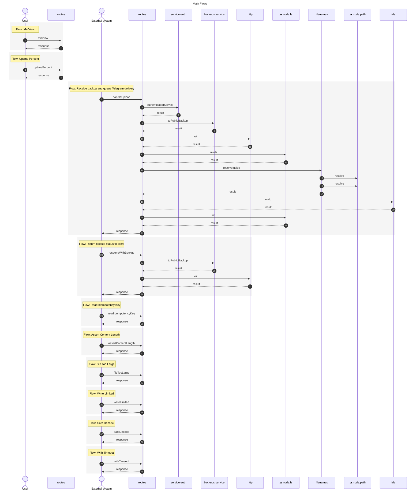

# Main Flows

> Interactions for the main entry points of the system

_Generated by [UMLFlow](https://github.com/umlflow) from the source code — the code is the source of truth. Edit `.umlflow/config.yaml` to customise; use the manual sections for notes._

<!-- UMLFLOW GENERATED BEGIN — do not edit inside this block; run `umlflow update` -->

**Analysis notes**

- ≈ Uncertain name: Me View — named by heuristic from routes@server/src/api/v1/app.meView; confirm with `umlflow semantic questions --kind flow-name`
- ≈ Uncertain name: Uptime Percent — named by heuristic from routes@server/src/api/v1/app.uptimePercent; confirm with `umlflow semantic questions --kind flow-name`
- ≈ Uncertain name: Read Idempotency Key — named by heuristic from routes@server/src/api/v1/backups.readIdempotencyKey; confirm with `umlflow semantic questions --kind flow-name`
- ≈ Uncertain name: Assert Content Length — named by heuristic from routes@server/src/api/v1/backups.assertContentLength; confirm with `umlflow semantic questions --kind flow-name`
- ≈ Uncertain name: File Too Large — named by heuristic from routes@server/src/api/v1/backups.fileTooLarge; confirm with `umlflow semantic questions --kind flow-name`
- ≈ Uncertain name: Write Limited — named by heuristic from routes@server/src/api/v1/backups.writeLimited; confirm with `umlflow semantic questions --kind flow-name`
- ≈ Uncertain name: Safe Decode — named by heuristic from routes@server/src/api/v1/backups.safeDecode; confirm with `umlflow semantic questions --kind flow-name`
- ≈ Uncertain name: With Timeout — named by heuristic from routes@server/src/api/v1/backups.withTimeout; confirm with `umlflow semantic questions --kind flow-name`
<!-- UMLFLOW GENERATED END -->

<!-- UMLFLOW MANUAL BEGIN — your notes below are preserved -->

<!-- UMLFLOW MANUAL END -->
