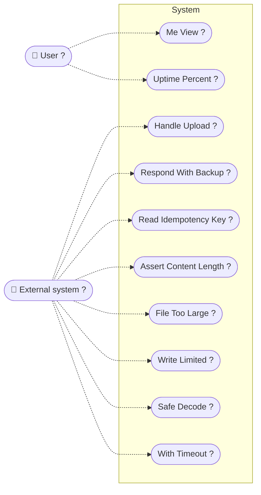

# System Usecases

> Actors and the capabilities the system exposes to them

_Generated by [UMLFlow](https://github.com/umlflow) from the source code — the code is the source of truth. Edit `.umlflow/config.yaml` to customise; use the manual sections for notes._

<!-- UMLFLOW GENERATED BEGIN — do not edit inside this block; run `umlflow update` -->

**Analysis notes**

- ≈ 10 use case name(s) were derived from operation names (marked "?").
<!-- UMLFLOW GENERATED END -->

<!-- UMLFLOW MANUAL BEGIN — your notes below are preserved -->

<!-- UMLFLOW MANUAL END -->
