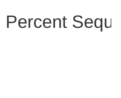

# Uptime Percent Sequence

> Execution path for the "Uptime Percent" scenario

_Generated by [UMLFlow](https://github.com/umlflow) from the source code — the code is the source of truth. Edit `.umlflow/config.yaml` to customise; use the manual sections for notes._

<!-- UMLFLOW GENERATED BEGIN — do not edit inside this block; run `umlflow update` -->

**Analysis notes**

- ℹ No flows matched this scope. Add scope.entryPoints or scope.include, or check `umlflow status`.
<!-- UMLFLOW GENERATED END -->

<!-- UMLFLOW MANUAL BEGIN — your notes below are preserved -->

<!-- UMLFLOW MANUAL END -->
